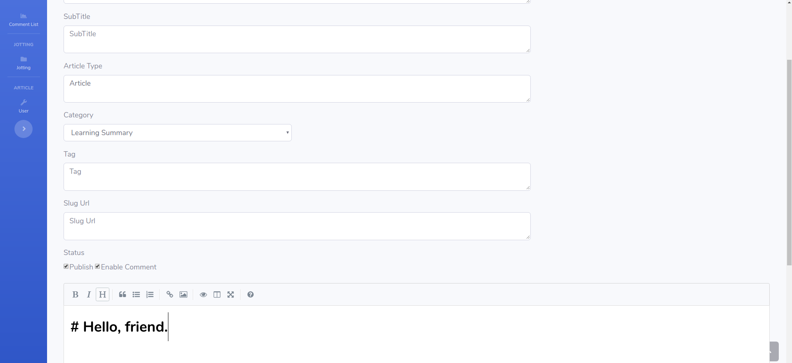

# unless

***

## About

This is a simple blog build by Rust and Bootstrap. It's my first blog made by myself, and it can be a project which I can keep writing with.

To name a project is always the most difficult part during the process. The reason why I name this project "unless" is that when I want to write a blog backend using Rust, I suddenly thought the project will never be done **unless** I started now. So as my first Rust project, I called it "unless". That's simple, but it does have a meaning.

***

## References

Seriously I'm not the expert of Rust and frontend programing, so I learned a lot from other projects. For frontend, I mainly use [**[startbootstrap-clean-blog](https://github.com/BlackrockDigital/startbootstrap-clean-blog)**] as blog's "surface" and use [**[startbootstrap-sb-admin-2](https://github.com/BlackrockDigital/startbootstrap-sb-admin-2)**] as the admin dashboard. For backend, I mainly learned the framework from [**[blog](https://github.com/ramsayleung/blog)**], however the idea of writing is different, so I changed much of the structure, besides I added lots of different custom features. Because of that I'd rather see it as a brand new blog backend instead of a fork of it.

Anyway, these projects helps me a lot and I used some source code from them to build my project. I really appreciate these people's work, I hope my work can help some of you, too. <3

Okay, enough chatting, let's see how it works!

***

## Getting Start

If you want to use or learn from this project, I'll see you as already learned Rust programing and installed Rust on your computer. If not, you can check [Start Rust](https://www.rust-lang.org/learn/get-started) to get some help.

### Rust

This project use Rocket as web framework, it needs nightly version Rust so firstly you need to change your Rust version to nightly.

`$ rustup default nightly`

### Diesel

This project use Diesel as ORM and Query Builder for Rust, and use postgres as database. You should install diesel_cli first, run:

`$ cargo install diesel_cli --no-default-features --features postgres`

### Postgresql

You need to install postgres database, this project passed test on postgres:10.1, so using docker is a good choice. 

### Add personal information

Firstly change your current directory to this project's root directory, like:"unless/", edit file ".env" and change the content to your information. Note that don't delete any line in this file casually, unless you know what you're doing, this may cause the environment variables lost.

Then edit "unless/migrations/2019-10-02-083116_create_user/up.sql" file, change the last line to your personal information which will be used to login the admin board. The third item is your password which hashed 10 times by "bcrypt", you can read [this](https://docs.rs/bcrypt) to generate your own password. **My password** is "yjn123456", you can use it to give it a try first or test if your generator is correct.

### Init database

Firstly confirm you're now at this project's root directory, like:"unless/". Run:

`$ diesel setup`

If everything is okay, you won't see any error shows. To test database works fine, run:

`$ diesel migration list`

If you see all six items begin with "[X]", that means all items work fine.

### Launch

Run:

`$ cargo run`

Wait until it shows `Rocket has launched from http://0.0.0.0:8000`, then you can use your browser and enter `http://127.0.0.1:8000` to test if everything works fine. When you already login, enter `http://127.0.0.1:8000/admin` to have a look at admin dashboard. You can use email address:"C0n5t4ntK@outlook.com" and password:"yjn123456" to enter which is my default user. You can change it to whatever you like as mentioned above.

Of course I know there're still some places have my own information, like title "C0n5t4ntK's Blog". If you want to use it as your own blog, you have to change these information by yourself, luckily these words ain't so many.

***

## Screenshots

Because of the monitor's size, these screenshots didn't show the whole view. You can check [my blog](https://www.elapse.life) which shows correctly.

### Index

About

Dashboard

List

Edit

***

Thanks a lot for your reading. If you have any idea about this project, feel free to talk to me~

For more information, please check [my personal blog](https://www.elapse.life).